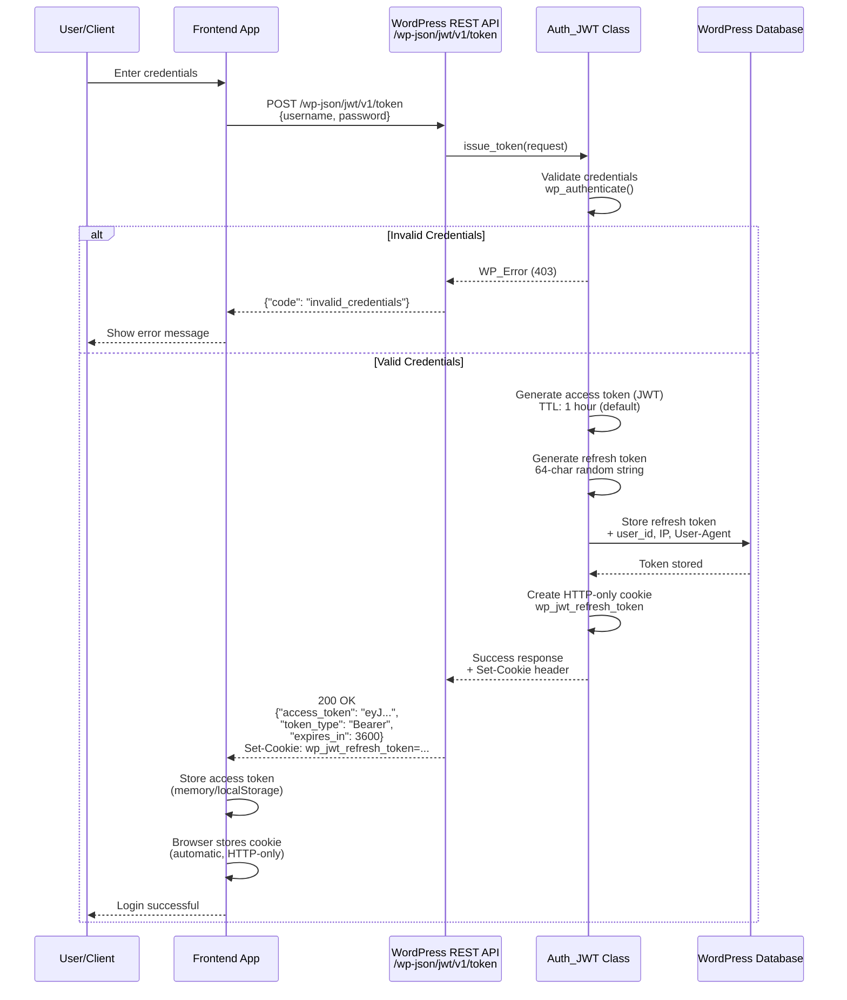
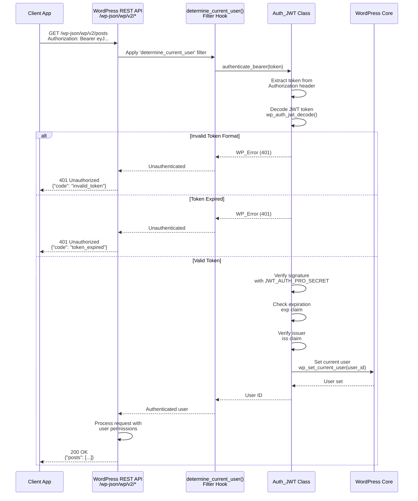
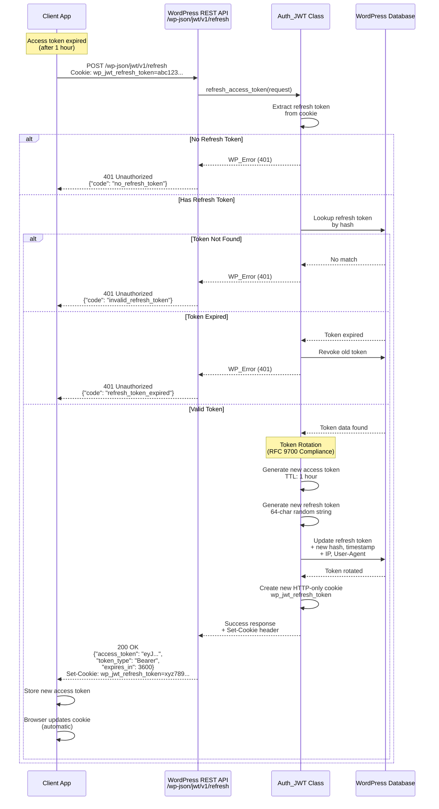
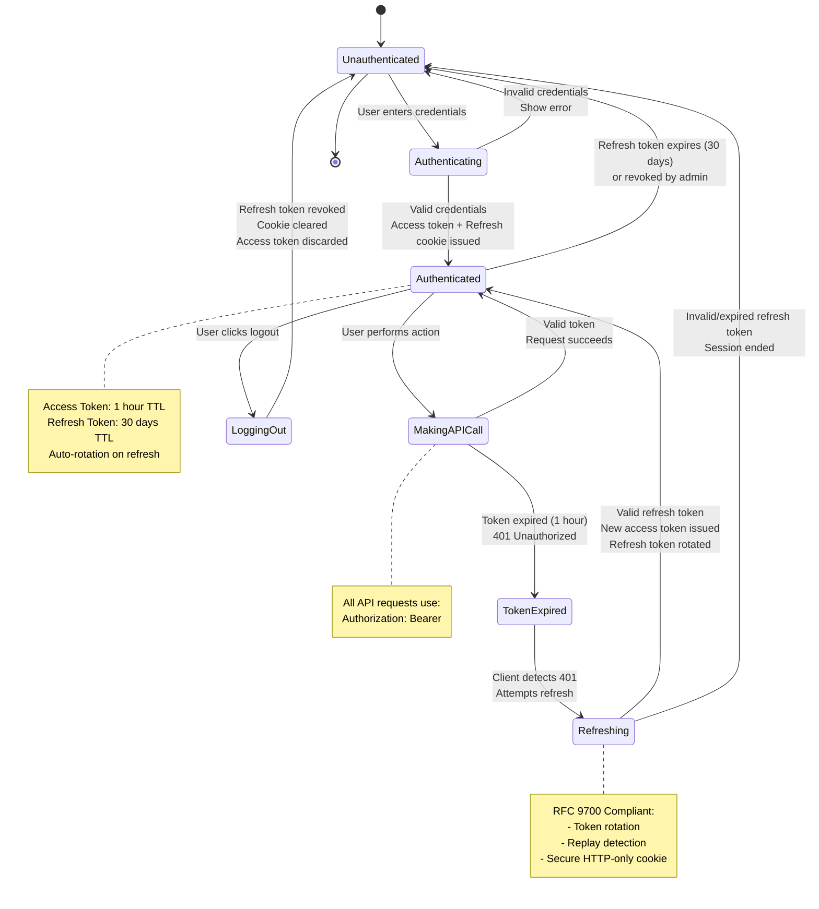
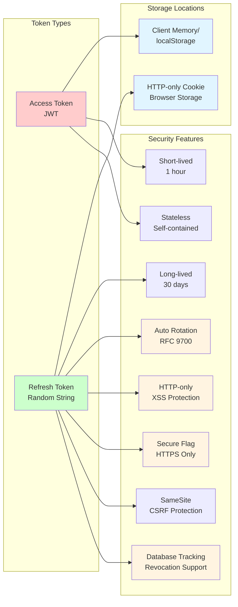

# JWT Authentication Workflow Diagrams

This document provides visual representations of the key workflows enabled by the JWT Auth Pro WordPress REST API plugin. These diagrams illustrate the secure authentication flow using JSON Web Tokens (JWT) with refresh token rotation.

## Table of Contents

1. [Authentication Flow](#1-authentication-flow)
2. [Token Validation Flow](#2-token-validation-flow)
3. [Token Renewal/Refresh Flow](#3-token-renewalrefresh-flow)
4. [Logout Flow](#4-logout-flow)
5. [Complete Session Lifecycle](#5-complete-session-lifecycle)

---

## 1. Authentication Flow

This diagram shows how a user logs in and receives a JWT access token along with a secure HTTP-only refresh token cookie.



### Key Components

- **User/Client**: End-user attempting to authenticate
- **Frontend App**: SPA, mobile app, or any client application
- **WordPress REST API**: `/wp-json/jwt/v1/token` endpoint
- **Auth_JWT Class**: Handles authentication logic
- **WordPress Database**: Stores refresh tokens with metadata

### Data Exchange

1. **Request**: Username and password (JSON)
2. **Response**: Access token (JWT) in response body
3. **Cookie**: Refresh token in HTTP-only, Secure cookie
4. **Database**: Refresh token hash, user ID, IP address, User-Agent

---

## 2. Token Validation Flow

This diagram illustrates how the server validates a JWT token on subsequent API requests.



### Token Validation Steps

1. **Extract Token**: Parse `Authorization: Bearer <token>` header
2. **Decode JWT**: Base64URL decode header and payload
3. **Verify Signature**: HMAC-SHA256 signature validation
4. **Check Expiration**: Validate `exp` claim against current time
5. **Verify Issuer**: Confirm `iss` claim matches expected value
6. **Set User**: Authenticate user for WordPress request context

### Security Checks

- ✅ Token signature verification
- ✅ Expiration time validation
- ✅ Issuer validation
- ✅ Token format validation

---

## 3. Token Renewal/Refresh Flow

This diagram shows how a client can refresh an expired access token using the HTTP-only refresh token cookie.



### Refresh Token Rotation

The plugin implements **automatic refresh token rotation** for enhanced security (RFC 9700 compliance):

1. **Old token used**: Client sends refresh token
2. **New tokens generated**: Both access and refresh tokens are regenerated
3. **Database updated**: Old refresh token is replaced with new one
4. **Cookie updated**: Browser receives new refresh token cookie
5. **Old token invalidated**: Previous refresh token can no longer be used

### Security Benefits

- ✅ **Replay attack prevention**: Each refresh token can only be used once
- ✅ **Breach detection**: Attempted reuse of old tokens indicates compromise
- ✅ **Limited exposure**: Short-lived tokens reduce attack window
- ✅ **Revocation support**: Tokens can be invalidated in database

---

## 4. Logout Flow

This diagram illustrates the token revocation process when a user logs out.

```mermaid
sequenceDiagram
    participant Client as Client App
    participant API as WordPress REST API<br/>/wp-json/jwt/v1/logout
    participant Auth as Auth_JWT Class
    participant DB as WordPress Database

    Client->>API: POST /wp-json/jwt/v1/logout<br/>Cookie: wp_jwt_refresh_token=abc123...
    
    API->>Auth: logout(request)
    Auth->>Auth: Extract refresh token<br/>from cookie
    
    alt No Refresh Token
        Auth-->>API: WP_Error (401)
        API-->>Client: 401 Unauthorized<br/>{"code": "no_refresh_token"}
    else Has Refresh Token
        Auth->>DB: Find refresh token<br/>by hash
        
        alt Token Found
            DB-->>Auth: Token data
            Auth->>DB: Revoke token<br/>UPDATE is_revoked = 1
            DB-->>Auth: Token revoked
        else Token Not Found
            Note over Auth: Token already invalid<br/>or doesn't exist
        end
        
        Auth->>Auth: Clear refresh token cookie<br/>Set-Cookie with Max-Age=0
        Auth-->>API: Success response<br/>+ Cookie deletion header
        
        API-->>Client: 200 OK<br/>{"message": "Logout successful"}<br/>Set-Cookie: wp_jwt_refresh_token=; Max-Age=0
        
        Client->>Client: Clear access token<br/>from memory/storage
        Client->>Client: Browser deletes cookie<br/>(automatic)
        Client-->>Client: Redirect to login
    end
```

### Logout Actions

1. **Revoke refresh token**: Mark as revoked in database
2. **Clear cookie**: Send cookie deletion header (`Max-Age=0`)
3. **Client cleanup**: Clear access token from memory/localStorage

### Security Considerations

- ✅ Database-backed revocation ensures tokens cannot be reused
- ✅ Cookie deletion prevents automatic refresh attempts
- ✅ Client-side cleanup removes access token
- ✅ All user sessions can be revoked administratively

---

## 5. Complete Session Lifecycle

This diagram shows the complete lifecycle of a user session from login to logout.



### State Descriptions

| State | Description | Duration |
|-------|-------------|----------|
| **Unauthenticated** | No valid session | Indefinite |
| **Authenticating** | Credential validation in progress | Seconds |
| **Authenticated** | Valid access token available | Up to 1 hour |
| **MakingAPICall** | Using access token for API request | Milliseconds |
| **TokenExpired** | Access token expired, refresh available | Until refresh attempt |
| **Refreshing** | Requesting new access token | Seconds |
| **LoggingOut** | Revoking tokens and clearing session | Seconds |

### Token Lifetimes

- **Access Token (JWT)**: 1 hour (default, configurable)
- **Refresh Token**: 30 days (default, configurable)
- **Session Cookie**: Same as refresh token expiration

---

## Additional Diagrams

### Component Architecture

```mermaid
graph TB
    subgraph "Client Layer"
        SPA[SPA/Mobile App]
        Browser[Web Browser]
    end
    
    subgraph "WordPress REST API Layer"
        Token[/wp-json/jwt/v1/token]
        Refresh[/wp-json/jwt/v1/refresh]
        Verify[/wp-json/jwt/v1/verify]
        Logout[/wp-json/jwt/v1/logout]
        WPAPI[/wp-json/wp/v2/*]
    end
    
    subgraph "Authentication Layer"
        AuthJWT[Auth_JWT Class]
        Filter[determine_current_user<br/>Filter Hook]
        Helpers[Helper Functions]
    end
    
    subgraph "Storage Layer"
        DB[(WordPress Database<br/>jwt_refresh_tokens)]
        Config[wp-config.php<br/>JWT_AUTH_PRO_SECRET]
    end
    
    SPA -->|1. Login| Token
    SPA -->|2. API Requests| WPAPI
    SPA -->|3. Refresh| Refresh
    SPA -->|4. Logout| Logout
    Browser -->|HTTP-only Cookie| Refresh
    Browser -->|HTTP-only Cookie| Logout
    
    Token --> AuthJWT
    Refresh --> AuthJWT
    Verify --> AuthJWT
    Logout --> AuthJWT
    WPAPI --> Filter
    Filter --> AuthJWT
    
    AuthJWT --> Helpers
    AuthJWT --> DB
    AuthJWT --> Config
    
    style SPA fill:#e1f5ff
    style Browser fill:#e1f5ff
    style AuthJWT fill:#fff4e1
    style DB fill:#f0f0f0
    style Config fill:#f0f0f0
```

### Security Model



---

## Key Features Highlighted in Diagrams

### 🔒 Security Features

1. **HTTP-only Cookies**: Refresh tokens stored in HTTP-only cookies prevent XSS attacks
2. **Token Rotation**: Automatic refresh token rotation on each use (RFC 9700 compliance)
3. **Short-lived Access Tokens**: 1-hour expiration limits exposure window
4. **Database Revocation**: All tokens can be revoked server-side
5. **Security Metadata**: IP address and User-Agent tracking for enhanced security

### ⚡ Performance Features

1. **Stateless Validation**: JWT tokens validated without database queries
2. **Efficient Refresh**: Quick token refresh without re-authentication
3. **Automatic Cookie Management**: Browser handles refresh token storage

### 🛡️ RFC 9700 Compliance

The plugin implements OAuth 2.0 Security Best Current Practice (RFC 9700):

- ✅ Refresh token rotation
- ✅ Replay attack detection
- ✅ HTTP-only cookie storage
- ✅ Short-lived access tokens
- ✅ Database-backed session tracking

---

## Usage in Documentation

These diagrams can be referenced in:

- **README.md**: Quick start and overview
- **API Documentation**: Endpoint behavior explanation
- **Security Documentation**: Security architecture
- **Developer Guide**: Integration examples
- **Troubleshooting**: Flow debugging

---

## Diagram Legend

| Symbol | Meaning |
|--------|---------|
| 🔒 | Security-related feature |
| ⚡ | Performance optimization |
| ✅ | Compliance/best practice |
| ⚠️ | Important consideration |

---

*These diagrams are created using Mermaid syntax and will render automatically on GitHub and most modern documentation platforms.*
